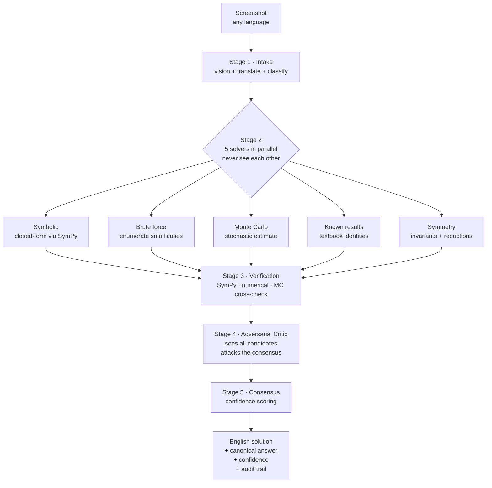

# Quant Solver

A multi-agent verification pipeline for quant math problems. Feed it a screenshot of a problem in any language — Chinese, English, Japanese, Korean, French, etc. — and it returns an English solution with a canonical final answer, a confidence score, and a full audit trail.

Single-pass LLM solutions to quant math are confidently wrong in subtle ways: continuous vs. discrete optimization, off-by-one indexing, missing boundary conditions, sign errors in symmetry arguments. Quant Solver runs five independent solver agents with different strategies, verifies the answer symbolically and numerically, then passes the whole thing through an adversarial critic before returning.

## Pipeline



### Why five solvers?

Different strategies fail on different problem shapes:

| Solver | Strong on | Weak on |
|---|---|---|
| Symbolic | closed-form algebra, geometry | combinatorial counting |
| Brute force | small-n combinatorics, finite state spaces | anything requiring a closed form |
| Monte Carlo | probability, expectations, intractable distributions | exact rationals, rare events |
| Known results | standard textbook problems (Josephus, Catalan, ...) | novel phrasings |
| Symmetry | problems with hidden structure | problems without one |

The critic sees all five and is explicitly prompted to look for traps (continuous-vs-discrete confusions, boundary cases, unit mismatches). Consensus + verification + critic-approval together yield a confidence tier (`high` / `medium` / `low`).

## Install

Requires Python ≥ 3.11 and an Anthropic API key.

```bash
uv sync
cp .env.example .env
# edit .env and set ANTHROPIC_API_KEY
```

## Usage

```bash
uv run quant-solver solve path/to/problem.png
uv run quant-solver solve path/to/problem.jpg --verbose
uv run quant-solver solve path/to/problem.png --json   # machine-readable
```

Accepts PNG, JPG, or WebP. The input is always an image — if you have text, screenshot it first.

Example output:

```
$ uv run quant-solver solve problem.png

Problem (detected language: zh):
  Assume strategy returns are normally distributed with annual Sharpe ratio 4.
  Find the probability of a loss next quarter, to 2 significant figures.

Final Answer: 2.3%
Confidence: high (5/5 solvers agree, verification passed, critic approved)
Audit trail: results/2026-04-21T15-30-00/problem/
```

Every run writes a directory under `results/` with the raw intake JSON, each solver's reasoning, the verifier's checks, the critic's attack, and the final consensus — so you can always see *why* an answer was returned.

## Configuration

All settings are read from environment variables (prefix `QS_`). Defaults live in [src/quant_solver/config.py](src/quant_solver/config.py):

| Var | Default | Purpose |
|---|---|---|
| `ANTHROPIC_API_KEY` | — | Your Anthropic key (required) |
| `QS_SOLVER_MODEL` | `claude-opus-4-7` | Solver + critic model |
| `QS_INTAKE_MODEL` | `claude-sonnet-4-6` | Vision + translation |
| `QS_CRITIC_MODEL` | `claude-opus-4-7` | Adversarial critic |
| `QS_MAX_TOKENS` | `4096` | Per-call max tokens |
| `QS_SOLVER_TIMEOUT_S` | `120` | Per-solver wall-clock timeout |
| `QS_MONTE_CARLO_TRIALS` | `1_000_000` | MC sample count |
| `QS_BRUTE_FORCE_MAX_N` | `20` | Brute-force enumeration ceiling |
| `QS_MAX_RETRIES` | `3` | Per-stage retry budget |
| `QS_RESULTS_ROOT` | `results` | Where audit trails are written |

## Project layout

```
src/quant_solver/
  cli.py              # typer entrypoint: solve, check-config
  pipeline.py         # orchestrates the five stages
  config.py           # pydantic-settings config
  models.py           # typed intermediates (Candidate, FinalAnswer, ...)
  anth_client.py      # thin async Anthropic wrapper
  prompts/            # all LLM prompts live here, one file each
  stages/             # intake, solvers, verifier, critic, consensus
  tools/              # sympy_tool, monte_carlo, brute_force subprocess runners
```

All prompts are external Markdown files under [src/quant_solver/prompts/](src/quant_solver/prompts/) — tuning accuracy means editing those, not Python.

## Architectural invariants

- Solvers **never see each other's outputs**. Only the critic does. This is what makes consensus meaningful.
- All internal reasoning is in English, regardless of source language.
- LLM-generated code is **never `exec`'d in-process** — always subprocessed with a timeout.
- Prompts live in `prompts/*.md`, never hardcoded in Python.
- Every run produces a directory of JSON artifacts so runs are fully reproducible and debuggable.

## Tests

```bash
uv run pytest                           # fast unit tests
uv run pytest -m slow                   # end-to-end (requires API key + image)
```

The slow integration test is opt-in via env vars:

```bash
QS_INTEGRATION_IMAGE=path/to/problem.png \
QS_INTEGRATION_EXPECTED="4/3" \
uv run pytest -m slow
```

## License

MIT.
